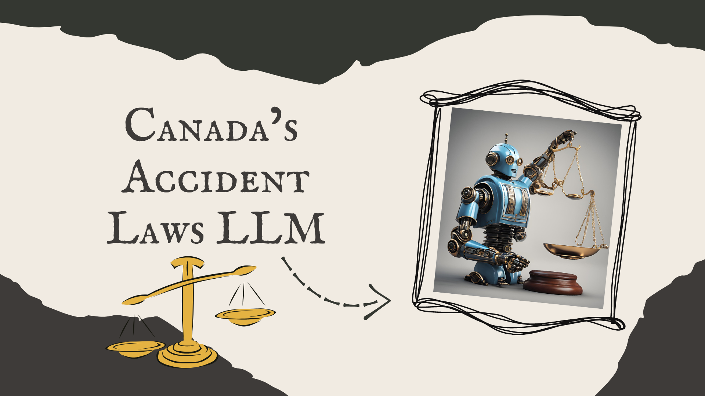

# Canadian-Accident-Law-LLM

## Overview
This project utilizes an open-source language model, Llama3, to assist in providing legal advice based on Canadian accident laws for insurance purposes. The application processes descriptions of accident situations and identifies relevant legal sections, liability, procedures, and recommendations. The legal information is extracted from a collection of PDF documents containing all relevant Canadian legal acts.

## Project Details
### Objective
The main objective of this project is to develop an AI-based tool that can:
1. Provide legal advice based on descriptions of accident situations.
2. Identify the relevant sections of Canadian law that apply to the situation.
3. Determine liability based on the given context.
4. Provide procedures and recommendations for dealing with the accident according to Canadian laws.

### Methodology
#### Data Collection and Preprocessing
- **Data Collection**: The data used for this project consists of PDF documents containing all legal acts related to Canadian accident laws. These documents are loaded and processed to extract relevant legal information.
- **Preprocessing**: The preprocessing phase involves loading the documents, splitting them into manageable chunks, and creating vector embeddings for efficient retrieval.

#### Model and Tools
- **Language Model**: The project uses the open-source Llama3 model via the ChatGroq API to analyze and classify the descriptions of accident situations.
- **Document Embedding**: GoogleGenerativeAIEmbeddings are used to create embeddings for the legal documents, enabling efficient similarity search and retrieval of relevant legal sections.
- **Vector Store**: FAISS (Facebook AI Similarity Search) is used to store and retrieve document vectors.

#### Application Workflow
1. **Document Loading and Embedding**: PDF documents are loaded and processed to create vector embeddings.
2. **Question Input**: Users can input questions related to accident situations or legal contexts.
3. **Retrieval and Response**: The system retrieves relevant document sections based on the input question and generates a response using the Llama3 model.

## Example Usage

**Input:** I was driving and someone hit me from behind.

**LLM Output:**
Based on the input "I was driving and someone hit me from behind", I analyze the situation and determine the applicable laws and procedures under Canadian law.

**Liability:** According to Canadian law, rear-end collisions typically involve the driver who hits from behind being at fault, as per standard traffic regulations and negligence principles.

**Procedure:**
1. Ensure safety by moving vehicles out of traffic if possible and checking for injuries.
2. Call the police to report the accident and provide a detailed statement.
3. Exchange information with the other driver, including names, contact information, and insurance details.
4. Take photographs of the accident scene, vehicle damage, and any relevant road conditions.
5. Notify your insurance company and provide all necessary documentation and statements.

**Additional Recommendations:**
- Seek medical attention even if no immediate injuries are apparent, as some injuries may manifest later.
- Keep detailed records of all interactions, reports, and expenses related to the accident.
- Consider consulting with a legal professional if you encounter any disputes or complications.

*Please note that the above procedure and additional recommendations are general guidelines and may vary depending on the specific circumstances of the case and the jurisdiction in which it is being investigated.*
